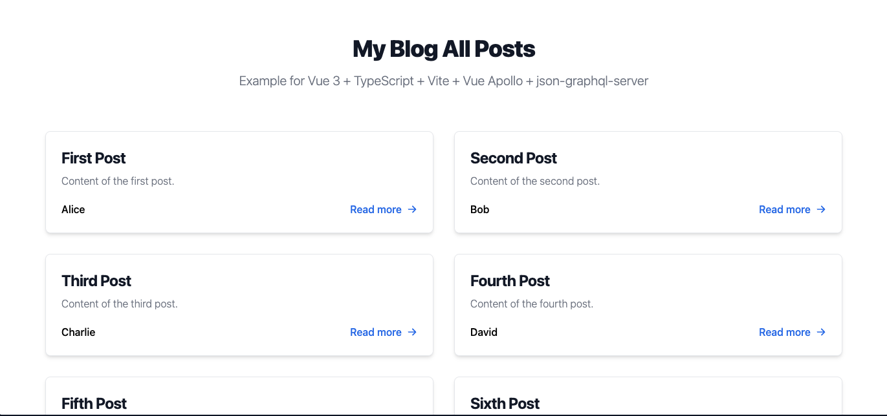

# Replit Template for Vue 3 + TypeScript + Vite + Vue Apollo + json-graphql-server



這個模板旨在提供一個簡單的方法，讓你使用 Vue 和 GraphQL 構建前端界面，並使用 `json-graphql-server` 作為簡易的後端 API。

## 特色

- **Vite**：快速的前端構建工具
- **TypeScript**：強類型的 JavaScript 擴展
- **Vue**：進行前端開發的框架
- **Vue Apollo**：在 Vue 中整合 GraphQL 的解決方案
- **json-graphql-server**：用於快速建立 GraphQL API 的工具

## 快速啟動

1. 複製此模板或在 Replit 上打開。

2. 安裝依賴：

   ```bash
   yarn install
   ```

3. 啟動開發伺服器：

   ```bash
   yarn start
   ```

這將自動啟動 `json-graphql-server`，一旦它啟動並且端口 4000 變得可用，Vite 開發伺服器將會啟動。

## 使用說明

當你啟動這個專案，它將運行兩個伺服器：

1. `json-graphql-server`：用於 GraphQL API 的後端伺服器。它使用 `db.js` 作為數據源。
2. Vite 的開發伺服器：用於前端開發和熱重載。

這兩個伺服器都是用 `concurrently` 和 `wait-on` 工具來啟動，確保 `json-graphql-server` 完全啟動後才運行 Vite 的伺服器。

你也可以單獨啟動前後端伺服器：

* 啟動前端伺服器
   ```bash
   yarn start:frontend
   ```

* 啟動後端伺服器
   ```bash
   yarn start:backend
   ``` 
